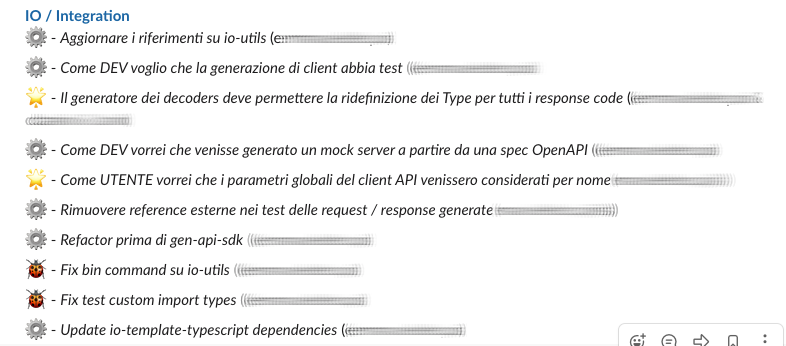

## PIVOTAL STORIES
This is a simple Python script to retrieve stories from Pivotal projects.
It is used to make a report of _X_ past days accepted (or in which states you prefer) stories for all interesting projects.

Since a report is made it is sent to Slack as a message.

### Setup
- _required_ ensure to provide a valid [Pivotal token](https://www.pivotaltracker.com/help/articles/api_token/) in the `pivotal.token` file
- _optional_ if you want to forward a message to Slack ensure to provide a valid [Slack token](https://slack.com/intl/en-it/help/articles/115005265703-Create-a-bot-for-your-workspace) in the `slack.token` file 

### Usage
```python
import datetime
from utils.pivotal import Pivotal
from utils.print import get_printable_stories
from utils.slack import send_slack_message

project_id = 1234567
pivotal = Pivotal("mypivotaltoken")
# a week ago from today
week_ago = datetime.datetime.now() - datetime.timedelta(days=7)
update_since = f"{week_ago:%m/%d/%Y}"

project = pivotal.get_project(project_id)
stories = pivotal.get_stories(project_id, update_since, ['delivered','accepted'])
printable_stories = get_printable_stories(stories, pivotal.get_project_membership(project_id))

# compose slack message
slack_message = ""
for ps in printable_stories:
    slack_message += "%s\n\n" % ps
# send message to slack
send_slack_message("myslacktoken", "#my_channel", slack_message)
```

